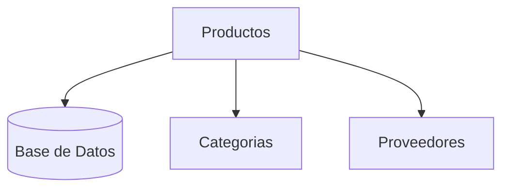
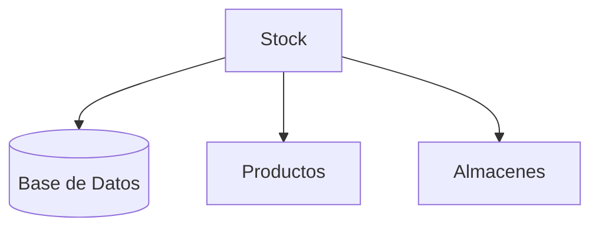
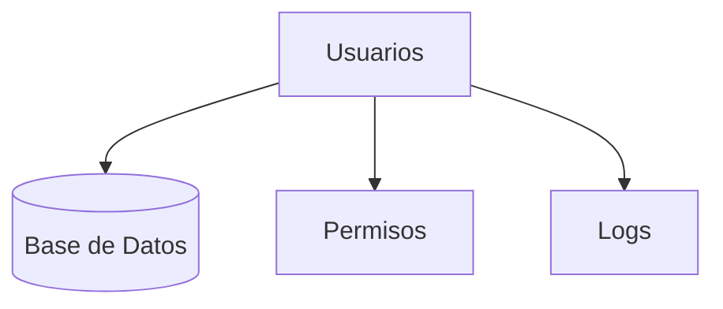
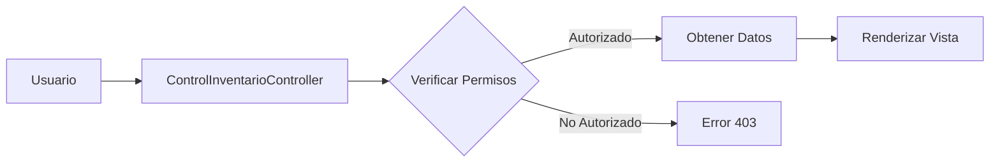
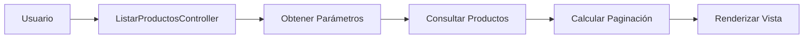
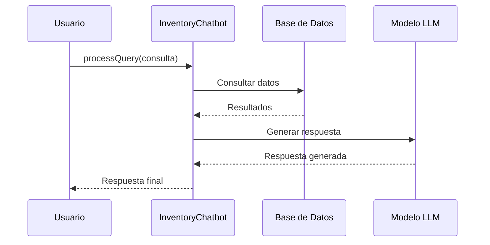

# 📦 Sistema de Gestión de Inventario (InvSys) - Referencia de API

<div align="center">

[]() 
[]() 
[]() 
[]()


*Sistema profesional para la gestión eficiente de inventarios*

</div>

## 📑 Índice de Contenidos

- [📋 Introducción](#-introducción)
- [🧩 Módulos](#-módulos)
  - [📝 Productos](#-módulo-de-productos)
  - [🏬 Inventario](#-módulo-de-inventario)
  - [👥 Usuarios](#-módulo-de-usuarios)
- [🎮 Controladores](#-controladores-principales)
- [🛠️ Utilidades](#-funciones-de-utilidad)
- [🖥️ Estructura de Vistas](#-estructura-de-vistas)
- [📏 Convenciones de Código](#-convenciones-de-código)

## 📋 Introducción

<div style="background-color: #f8f9fa; padding: 15px; border-radius: 5px; border-left: 5px solid #007bff;">

Este documento describe las principales clases y métodos disponibles en el Sistema de Gestión de Inventario (InvSys). Esta referencia está destinada a desarrolladores que necesiten extender o mantener el sistema.

</div>

## 🧩 Módulos

### 📝 Módulo de Productos

<details>
<summary><strong>Clase <code>Productos</code></strong> <span style="color: #28a745;">✓</span></summary>

**Ubicación**: `app/Models/productos/productos.php`

#### Diagrama de Relaciones



#### Métodos Principales

| Método | Descripción | Retorno |
|--------|-------------|---------|  
| `__construct($conn)` | Inicializa el modelo con la conexión a la base de datos. | `void` |
| `validarProducto($id_producto)` | Verifica si un producto existe en la base de datos. | `boolean` |
| `obtenerProductos()` | Retorna todos los productos activos. | `array` |
| `obtenerProductosConPaginacion($limit, $offset)` | Retorna productos con paginación para mostrar en listados. | `array` |
| `contarTotalProductos()` | Cuenta el número total de productos activos en el sistema. | `int` |
| `eliminarProducto($id_producto)` | Realiza una eliminación lógica de un producto (cambia su estado a inactivo). | `boolean` |

#### Ejemplo de Uso

```php
// Ejemplo de uso
$productos = new Productos($conn);
$listaProductos = $productos->obtenerProductos();

// Ejemplo de paginación
$pagina = 1;
$porPagina = 10;
$offset = ($pagina - 1) * $porPagina;
$productosPaginados = $productos->obtenerProductosConPaginacion($porPagina, $offset);
```

> **Nota**: Todos los métodos de eliminación realizan borrados lógicos, no físicos, para mantener la integridad referencial.

</details>

### 🏬 Módulo de Inventario

<details>
<summary><strong>Clase <code>Stock</code></strong> <span style="color: #28a745;">✓</span></summary>

**Ubicación**: `app/Models/stock/stock.php`

#### Diagrama de Relaciones



#### Métodos Principales

| Método | Descripción | Retorno |
|--------|-------------|---------|  
| `__construct($conn)` | Inicializa el modelo con la conexión a la base de datos. | `void` |
| `verInventario($id_almacen)` | Retorna el inventario completo de un almacén específico. | `array` |
| `obtenerAlmacenes()` | Retorna la lista de todos los almacenes disponibles. | `array` |
| `obtenerMovimientosRecientes()` | Retorna los últimos movimientos de inventario registrados. | `array` |
| `obtenerProductosBajoStock()` | Retorna productos que están por debajo del nivel mínimo de stock. | `array` |

#### Ejemplo de Uso

```php
// Ejemplo de uso
$stock = new Stock($conn);
$inventario = $stock->verInventario(1); // Inventario del almacén con ID 1

// Verificar productos con bajo stock
$productosBajoStock = $stock->obtenerProductosBajoStock();
foreach ($productosBajoStock as $producto) {
    echo "Alerta: {$producto['nombre']} está por debajo del stock mínimo";
}
```

> **Importante**: El sistema genera alertas automáticas para productos con bajo stock.

</details>

### 👥 Módulo de Usuarios

<details>
<summary><strong>Clase <code>Usuarios</code></strong> <span style="color: #28a745;">✓</span></summary>

**Ubicación**: `app/Models/usuarios/usuarios.php`

#### Diagrama de Relaciones



#### Métodos Principales

| Método | Descripción | Retorno |
|--------|-------------|---------|  
| `__construct($conn)` | Inicializa el modelo con la conexión a la base de datos. | `void` |
| `validarUsuario($email, $password)` | Verifica las credenciales de un usuario para el inicio de sesión. | `array/boolean` |
| `crearUsuario($nombre, $apellido, $email, $password, $nivel_acceso)` | Crea un nuevo usuario en el sistema. | `int/boolean` |
| `actualizarUsuario($id_usuario, $nombre, $apellido, $email, $nivel_acceso)` | Actualiza la información de un usuario existente. | `boolean` |
| `cambiarPassword($id_usuario, $nueva_password)` | Actualiza la contraseña de un usuario. | `boolean` |

#### Ejemplo de Uso

```php
// Ejemplo de uso para login
$usuarios = new Usuarios($conn);
$resultado = $usuarios->validarUsuario('usuario@ejemplo.com', 'contraseña');

// Crear un nuevo usuario
$nuevoUsuario = $usuarios->crearUsuario('Juan', 'Pérez', 'juan@ejemplo.com', 'contraseña123', 2);
if ($nuevoUsuario) {
    echo "Usuario creado con ID: $nuevoUsuario";
}
```

> **Seguridad**: Todas las contraseñas se almacenan utilizando hash bcrypt para mayor seguridad.

</details>

## 🎮 Controladores Principales

<details>
<summary><strong>Clase <code>ControlInventarioController</code></strong> <span style="color: #28a745;">✓</span></summary>

**Ubicación**: `app/Controller/stock/verInventarioController.php`

#### Diagrama de Flujo



#### Métodos Principales

| Método | Descripción | Retorno |
|--------|-------------|---------|  
| `__construct($conn)` | Inicializa el controlador con la conexión a la base de datos. | `void` |
| `verInventario()` | Procesa la solicitud para ver el inventario de un almacén específico. | `array` |
| `obtenerListas()` | Obtiene las listas necesarias para mostrar en el formulario de stock. | `array` |

#### Ejemplo de Uso

```php
// Ejemplo de uso
$controlador = new ControlInventarioController($conn);
$datos = $controlador->verInventario();

// Renderizar vista con los datos
require_once 'app/Views/stock/verInventario.php';
```

</details>

<details>
<summary><strong>Clase <code>ListarProductosController</code></strong> <span style="color: #28a745;">✓</span></summary>

**Ubicación**: `app/Controller/productos/listarProductosController.php`

#### Diagrama de Flujo



#### Métodos Principales

| Método | Descripción | Retorno |
|--------|-------------|---------|  
| `__construct($conn)` | Inicializa el controlador con la conexión a la base de datos. | `void` |
| `listarProductos()` | Procesa la solicitud para listar productos con paginación. | `array` |

#### Ejemplo de Uso

```php
// Ejemplo de uso
$controlador = new ListarProductosController($conn);
$datos = $controlador->listarProductos();

// Renderizar vista con los datos
require_once 'app/Views/productos/listarProductos.php';
```

</details>

## 🛠️ Funciones de Utilidad

<details>
<summary><strong>Función <code>nivelRequerido</code></strong> <span style="color: #28a745;">✓</span></summary>

**Ubicación**: `config/funciones.php`

#### Descripción

Verifica si el usuario actual tiene el nivel de acceso requerido para acceder a una funcionalidad.

#### Sintaxis

```php
nivelRequerido($nivel_minimo)
```

#### Parámetros

| Parámetro | Tipo | Descripción |
|-----------|------|-------------|
| `$nivel_minimo` | `int` | Nivel mínimo de acceso requerido |

#### Retorno

`boolean` - `true` si el usuario tiene acceso, `false` en caso contrario.

#### Ejemplo de Uso

```php
// Ejemplo de uso
if (nivelRequerido(2)) {
    // El usuario tiene acceso a esta funcionalidad
    mostrarPanelAdministracion();
} else {
    // Redirigir o mostrar error
    header('Location: acceso_denegado.php');
}
```

</details>

<details>
<summary><strong>Clase <code>InventoryChatbot</code></strong> <span style="color: #28a745;">✓</span></summary>

**Ubicación**: `chatbot_ollama.php`

#### Diagrama de Flujo



#### Métodos Principales

| Método | Descripción | Retorno |
|--------|-------------|---------|  
| `__construct()` | Inicializa el chatbot con la conexión a la base de datos y configura el prompt del sistema. | `void` |
| `processQuery($query)` | Procesa una consulta en lenguaje natural y devuelve la respuesta. | `string` |

#### Ejemplo de Uso

```php
// Ejemplo de uso
$chatbot = new InventoryChatbot();
$respuesta = $chatbot->processQuery('¿Cuántos productos tenemos en stock?');
echo $respuesta; // Muestra la respuesta generada

// Integración en interfaz de usuario
$pregunta = $_POST['pregunta'] ?? '';
if (!empty($pregunta)) {
    $chatbot = new InventoryChatbot();
    $respuesta = $chatbot->processQuery($pregunta);
    echo json_encode(['respuesta' => $respuesta]);
}
```

> **Nota**: El chatbot utiliza un modelo de lenguaje para interpretar consultas en lenguaje natural y convertirlas en consultas SQL.

</details>

## 🖥️ Estructura de Vistas

<div style="background-color: #f8f9fa; padding: 15px; border-radius: 5px; border-left: 5px solid #28a745;">

Las vistas del sistema se encuentran en la carpeta `app/Views/` y están organizadas por módulos:

</div>

| Carpeta | Descripción | Componentes Principales |
|---------|-------------|-------------------------|
| `productos/` | Vistas relacionadas con la gestión de productos | Listado, Creación, Edición, Detalles |
| `stock/` | Vistas relacionadas con la gestión de inventario | Inventario, Movimientos, Alertas |
| `usuarios/` | Vistas relacionadas con la gestión de usuarios | Perfil, Listado, Permisos |
| `proveedores/` | Vistas relacionadas con la gestión de proveedores | Listado, Contactos, Pedidos |
| `includes/` | Componentes reutilizables en múltiples vistas | Header, Footer, Sidebar, Alerts |
| `components/` | Componentes de UI específicos | Tables, Forms, Cards, Modals |

### Vista Previa de la Interfaz

<div align="center">


*Vista previa del panel de control principal*

</div>

## 📏 Convenciones de Código

### Nomenclatura

<div style="background-color: #f8f9fa; padding: 15px; border-radius: 5px; border-left: 5px solid #fd7e14;">

Seguir estas convenciones es obligatorio para mantener la consistencia del código en todo el proyecto.

</div>

| Tipo | Convención | Ejemplo | Notas |
|------|------------|---------|-------|
| **Clases** | PascalCase | `ControlInventarioController` | Nombres descriptivos que indiquen su función |
| **Métodos y funciones** | camelCase | `verInventario()` | Verbos que describan la acción |
| **Variables** | camelCase | `$totalProductos` | Nombres claros y descriptivos |
| **Archivos de clase** | Mismo nombre que la clase | `ControlInventarioController.php` | Un archivo por clase |
| **Constantes** | UPPER_CASE | `MAX_PRODUCTOS` | Separadas por guiones bajos |
| **Tablas BD** | snake_case | `productos_categorias` | En plural, descriptivas |

### Estructura de Archivos

<div style="background-color: #f8f9fa; padding: 15px; border-radius: 5px; border-left: 5px solid #6f42c1;">

La estructura de archivos sigue un patrón MVC (Modelo-Vista-Controlador) para facilitar el mantenimiento y la escalabilidad.

</div>

| Tipo | Ruta | Responsabilidad |
|------|------|---------------|
| **Modelos** | `app/Models/{modulo}/{nombre_modelo}.php` | Lógica de negocio y acceso a datos |
| **Controladores** | `app/Controller/{modulo}/{nombre_controlador}.php` | Procesamiento de solicitudes |
| **Vistas** | `app/Views/{modulo}/{nombre_vista}.php` | Presentación de datos |
| **Configuración** | `config/{nombre_config}.php` | Configuraciones del sistema |
| **Utilidades** | `utils/{nombre_utilidad}.php` | Funciones de ayuda |

---

<div align="center">

*Sistema de Gestión de Inventario (InvSys) - Referencia de API*  
*Versión 1.0*

[Volver al inicio](#-sistema-de-gestión-de-inventario-invsys---referencia-de-api)


</div>